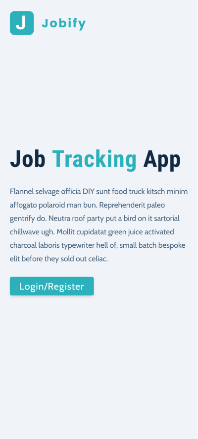
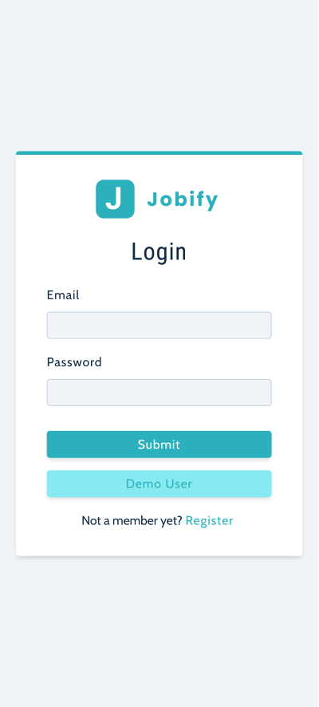
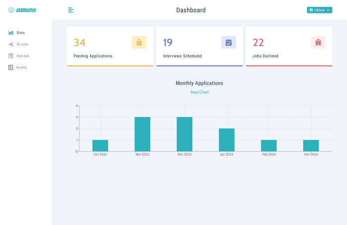
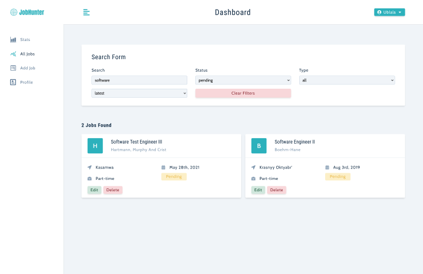
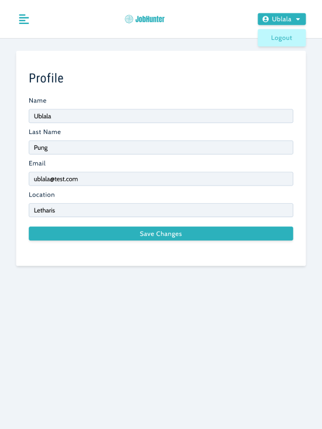

# Job-Hunter App

This web-app is designed to keep track of a users job application status. A user that is hunting for a job can enter information about that job including the name of the company, the location of the job, type of job (full-time, part-time, internship), the title of the position and the status of the application (Pending, Interview or declined). The app records and displays all jobs that have been applied for and shows stats for the past 6 months of job applications in a bar or area graph as per the users choice. The user can also search and/or sort through all jobs in the database.

This is my solution to the Jobify web app from John Smilga's MERN Stack Course 2023 - MongoDB, Express, React and NodeJS.

## Table of contents

- [Overview](#overview)
  - [The challenge](#the-challenge)
  - [Screenshot](#screenshot)
  - [Links](#links)
  - [Built with](#built-with)
  - [What I learned](#what-i-learned)
  - [Continued development](#continued-development)
  - [Useful resources](#useful-resources)
  - [Author](#author)
  - [Acknowledgments](#acknowledgments)

## Overview

### The challenge

Users should be able to:

- Securely register and login to web-app
- Ability to add and edit and delete jobs
- Change user profile and update DB
- Search through all jobs using any one of the search fields

### Screenshot

### Links

- Solution URL: [Github-rep](https://github.com/PeshwariNaan/jobsite-mern-app.git)
- Live Site URL: [Live-Link](https://jobhunt-mern-app.onrender.com)

### Built with

- [React](https://reactjs.org/) (Create-React-App)
- [React Router 6](https://github.com/remix-run/react-router/blob/main/docs/getting-started/tutorial.md)
- MongoDB / Atlas
- Mongoose V6
- Express
- React Context API
- JWT for authentication and authorization (using secure cookies)
- "express-async-errors" package
- [Mockaroo](https://mockaroo.com/) - For creating test data. This is awesome if you haven't seen it before.
- [Render](https://render.com/) - Hosting service
- [Styled Components](https://styled-components.com/) - For styles

### What I learned

This course had a great deal of content and I in turn learned a lot as well as revisited some topics that have since been updated and revised such as React Router and styled-components.

- First and foremost is what I learned from working with Node.js and MongoDB such as furthering my understanding of middleware and creating robust schemas in Mongoose. This particular project doesn't cut too deep into how complex schemas can get, but it served well to practice and apply what I have learned in the past.

- I learned yet another method of error handling that was not overly complex and this was also the first time that I have used the 'http-status-codes' package for error handling. This package can really help with code readability.

- Forms handling. As any developer knows, handling forms will be a part of any project. I really liked how the form components were built in this project, they were very simple. The state is updated dynamically for each input cutting way down on the complexity and volumn of code. There isn't mauch in the way of validation on the front end but I left with a solid baseline to work with in the future.

- Authorization and authenication using JWT and secure cookies. In the past I was only able to use json web tokens with local storage which is a very insecure way to use tokens. Just recently I have learned how to use the tokens in conjuction with cookies to create a secure user experience. This was only the second time I have implemented cookies but I feel to have a solid foundation now.

- Getting mock data using Mockaroo. As shown in the 'Built with' section, I had the privilege of learning Mockaroo. It's a really cool service where you can create datasets to use while you are testing your application. I've created some of these from scratch in the past and it's a huge time drain that could be better spent doing something else. This simple service can create mock data super fast and easy.

- Styled components. I have worked plenty with styled components in a lot of projects but I learned that I was doing it very inefficiently. The instructors approach on styling is way more straight forward than how I was doing things before and really opened my eyes to how S.C. are really supposed to be used. This alone will save me a lot of time and frustration on future projects.

### Continued development

In short, the only way to continue on is to build, build, build. If it's one thing I've learned in this journey is that none of this information sticks without continuous application. Now that my backend skills with React, Node, express, and Mongo are growing, I can tackle some of the larger projects in [Frontend Mentor](https://www.frontendmentor.io/home). This is a great site that offers projects to build for growing developers. They give just the design specifications as well as the images for a given project and you build it with your choice of code, libraries and frameworks. No code is given so the final result is a true reflection of the developers skill and it's a great way to improve on all levels and has a good community for support.

### Useful resources

- [Mockaroo](https://mockaroo.com/)
- [Styled Components](https://styled-components.com/)

## Author

- [J.D. Browne](https://github.com/PeshwariNaan)

## Acknowledgments

All my acknowledgement goes to [John Smilga](https://johnsmilga.com/) and his awesome content and courses.
